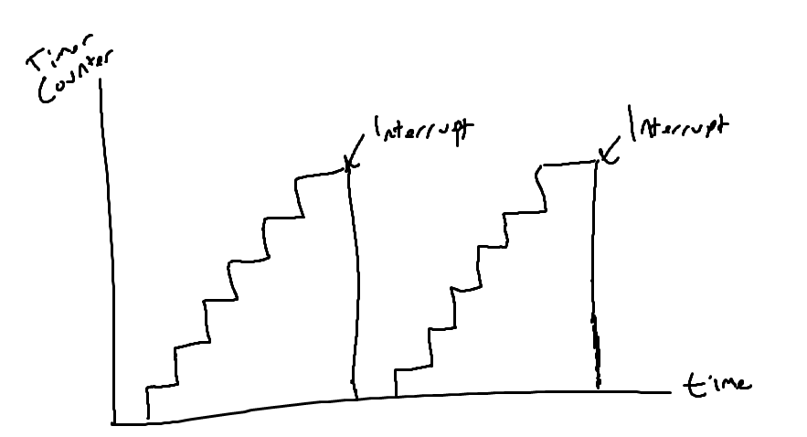

# Quick Introduction To Embedded Dev

# Peripherals

Most Microcontrollers have more than just a CPU, RAM, or Flash Memory - they contain sections of silicon which are used for interacting with systems outside of the microcontroller, as well as directly and indirectly interacting with their surroundings in the world via sensors, motor controllers, or human interfaces such as a display or keyboard. These components are collectively known as Peripherals.

These peripherals are useful because they allow a developer to offload processing to them, avoiding having to handle everything in software. Similar to how a desktop developer would offload graphics processing to a video card, embedded developers can offload some tasks to peripherals allowing the CPU to spend its time doing something else important, or doing nothing in order to save power.

> **For Example:** GPIO, I2C, SPI, UART, Timers etc.

Peripherals are crucial to us since most of the microcontrollers we work with are single-threaded, which means we cannot perform tasks asynchronously.

## Interrupts
An **interrupt** is a mechanism that temporarily halts the normal sequential execution of code to immediately execute a predefined function (callback). Once the callback is completed, the processor resumes execution from where it was interrupted.

Interrupts are widely used in embedded systems to handle **asynchronous events** such as:
-   Timer overflows
-   External pin changes (e.g., button presses)
-   Data reception over UART/I2C/SPI
-   Fault detections

## Timers

Timers are essential peripherals embedded within microcontrollers that facilitate precise time-based operations. They are capable of performing a wide range of tasks, including time measurement, event counting, pulse-width modulation (PWM) generation, input signal capturing, and periodic interrupt generation.

 Yes I drew this 
A timer contains an internal **counter** that increments by one at a specific frequency, which is derived from the microcontroller’s clock and the timer's **prescaler**. When this counter reaches a predefined value, the timer can generate an **interrupt**.

The timer's counter must be reset **manually**; otherwise, it will continue counting until it overflows and wraps around to 0. After resetting, the timer also needs to be configured again to start.

Timers have a number of priority to handle collisions (which actually happen way more often than you might imagine at first). More prioritized timers will interrupt the other timer's interrupt. 
 I don't think you'll need the pressure values if you can't deploy the parachute in time (which we TOTALLY haven't got wrong ourselves in the past). 

You should not overlook the fact that **peripherals operate asynchronously** with respect to the main microcontroller. For example, a timer may continue running even if your calculations in the main loop have not yet finished. More critically, **an interrupt can be missed** if callback functions are not handled correctly. Therefore, **timers and their priorities must be configured properly** to ensure reliable and deterministic behavior.
